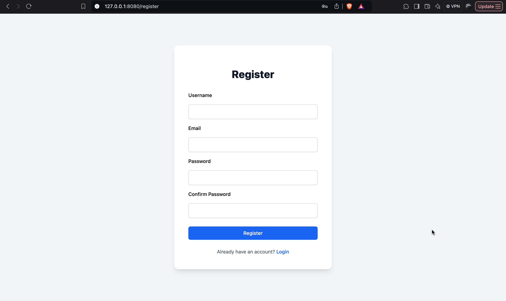
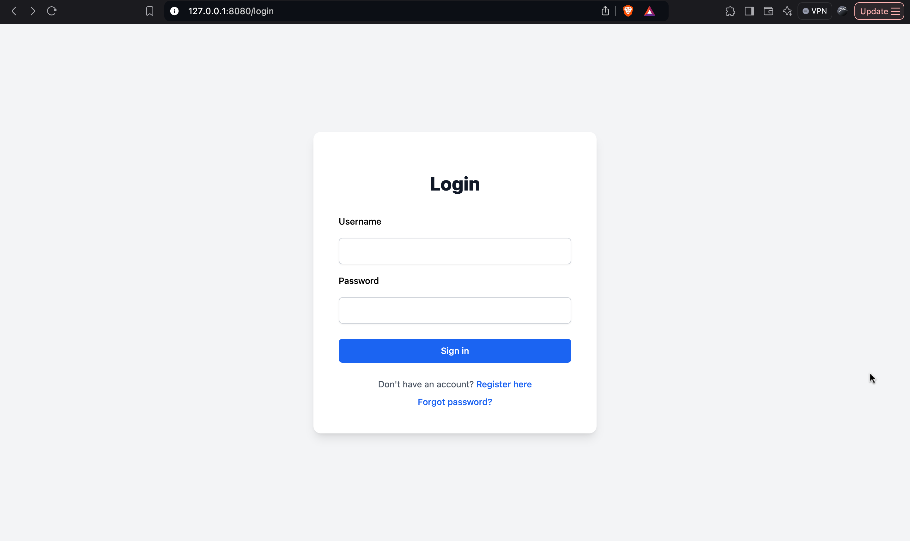
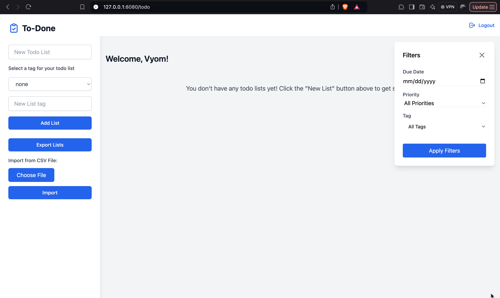
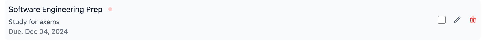

  

<h2 align="center">The Only Todo List You Need</h2>

# TO-DONE
The To-Done Web Application is a dynamic and user-friendly task management platform designed to simplify and enhance productivity for individuals and teams. It provides a seamless way to create, organize, and share to-do lists with collaborators, ensuring that everyone stays aligned and on track.

**Key Features:**

Effortless List Creation: Users can create and manage multiple to-do lists with tags and priorities for better categorization.

Task Tracking: Add notes, set due dates, and assign priority levels to tasks for a clear and structured workflow.

Import/Export Capability: Easily import tasks from CSV files or export lists to share with stakeholders.

Customizable Experience: Tailor your task management experience with flexible filters and tagging options.

**Why Choose To-Done?**

To-Done is designed with simplicity and functionality in mind, catering to users who need an intuitive yet powerful tool to keep track of tasks. Whether you're managing personal goals or coordinating a group project, To-Done ensures that no task is overlooked. Its collaboration features make it ideal for team settings, allowing users to work together effectively.

**Empower your productivity and achieve more with To-Done Web Application—because your tasks deserve to be done, not just planned.**

### Videos

https://github.com/user-attachments/assets/fd124d2e-3efe-4903-b56d-f55147c7d126

https://github.com/user-attachments/assets/3f020903-c46e-408e-866e-7f41d50666be

### Target Audience
To-Done is ideal for:
- **Students**: Manage assignments and deadlines.
- **Professionals**: Track work tasks and project milestones.
- **Teams**: Collaborate on shared tasks and responsibilities.

Contents
========

 * [Why?](#why)
 * [Features](#key-features-last-version)
 * [New Features](#new-features)
 * [Upcoming Features](#upcoming-features)
 * [Quick Start](#quick-start)
 * [Documentation](#Documentation)
 * [Want to contribute?](#want-to-contribute)
 * [License](#license)
 * [Developer](#developers-new-version)

### Why?

We wanted to work on something that is:

+ Useful, serves some real purpose
+ Easy to start with a basic working version and lends itself to adding new features incrementally to it
+ Easily divisible in modules/features/tasks that can be parallely done by five developers 
+ Diverse enough so that a lot of Software Engineering practices is required/involved 

`to-done` is a todo list app that is actually useful, very easy to create a basic working version with where a ton of new features can be added, touches upon all the aspects of web programming, database, working in a team etc.

### Features 
 * Register
 * Login
 * Create, Update, Delete Todo Lists
 * Quickly Create Todo Lists From Existing Templates
 * Create Your Own Templates
 
### Features (Last Version)
 * Shared List
 * Add Due Date To Tasks
 * Dark Mode
 * Add Tags To Todo Lists For Customizable Grouping

### New Key Features
 * Editing and Deletion
 * Priority Levels
 * Notes and Tags
 * Filtering
 * UI Overhaul

### Quick Start

 * Refer to INSTALL.md for setting up & running this project
 
### Documentation
* [Refer to this page](https://software-engineering-project-pkhsak.github.io/To-Done/views.html) for exhaustive documentation

### APP AFTER ADDING NEW FEATURES 

#### Register

    

#### Login

     

#### HomePage

    
     
     
    
#### Due Date, Priority Tag

    

# Project Funding

Our project at the moment is not funded by any organization/individual.

# Our Improvements 

**Editing and Deletion:**
The software in its’ original state did not allow for editing or
deleting created tasks which would not allow the user to
reschedule or reprioritize. These functionalities have been added
to the code

**Priority Levels:**
Each task now has a priority level assigned to it for users’ easy
prioritization

**Notes and Tags:**
The software now allows a user to attribute certain notes with a
task. This allows users to add additional bits of context to their
work. Moreover, there is also an added feature to add tags to a
task for easier categorization

**Filtering:**
The system now includes a way to filter out tasks based on criteria
like due date, as well as the newly introduced priority levels and
tags for easier prioritization and more granular control

**UI Overhaul:**
The system has moved from a dated, ancient UI to a much more
modern user interface that uses card-based displays to
emphasize task content and improve usability and accessibility

# Future Scope

**Recurring Tasks:**
Additional functionality could be added for recurring tasks that
could be configured for daily, weekly and monthly frequencies

**Calendar Integration:**
Can be integrated with a third party calendar like Google,
Microsoft or Notion so as to let the user schedule these tasks with
own personal work and/or professional work

**Task prioritization recommendations:**
One can add a feature to personalize task prioritization according
to due dates, priority levels and being able to club certain tasks
together

**Miscellaneous Productivity Add-ons:**
The system could also be improved to measure and enhance
productivity using strategies like pomodoro timers, email
reminders, progress statistics and charts

### Want to Contribute?

Want to contribute to this project? Learn about [Contributing](CONTRIBUTING.md). Not sure where to start? Have a look at 
the [good first issue](https://github.com/shahleon/smart-todo/issues?q=is%3Aissue+is%3Aopen+label%3A%22good+first+issue%22). 

### Need help?

Found a glitch or an erorr, have a new feature ideas or need help with deploying the web-app? You can raise an issue [Issue](https://github.com/CSC510SEFall24/To-Done/issues) to notify us.

### License

Distributed under the MIT License. See [LICENSE](LICENSE) for more information.

### Developers (New Version)

<table>
  <tr>
    <td align="center"><a href="https://github.com/vyompatel77"> <b>Vyom Patel</b></a></td>
    <td align="center"><a href="https://github.com/rarchitgupta"> <b>Archit Gupta</b></a> </td>
    <td align="center"><a href="https://github.com/Bhavishya-T"> <b>Bhavishya Tarun</b></a> </td>
  </tr>
</table>

### Developers (Last Version)

* Akarsh Reddy (https://github.com/akarsh16reddy)
* Prateek Kamath (https://github.com/PrateekKamath)
* Himanshu Singh (https://github.com/123standup)
